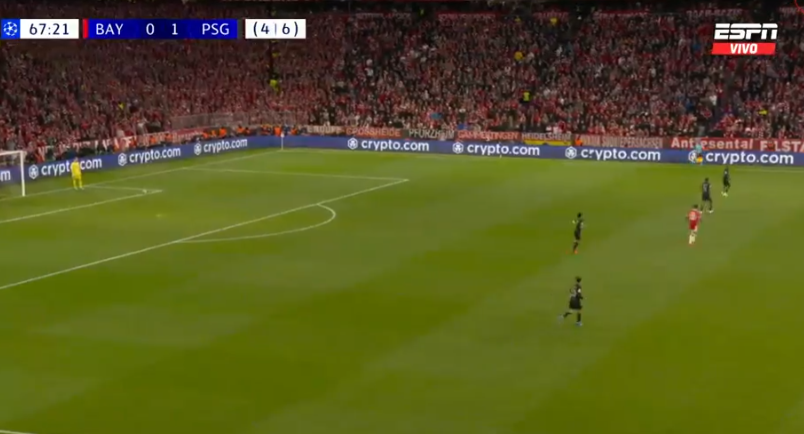
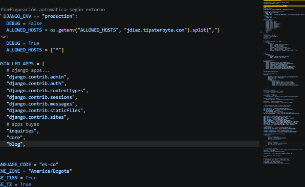

# Por qué las integraciones de Zoho SIEMPRE fallan en el 6to mes

Llevo 13 años haciendo esto. Y veo exactamente el mismo patrón repetirse una y otra vez.

Tú haces una integración con Zoho CRM. Funciona perfecto. Pasas UAT. Lo pones en producción. Todo funciona genial.

Llega el mes 6. Y empieza a fallar. Nadie sabe por que.

---

## El patrón que nadie ve

1.  ✅ Mes 1: Perfecto, todo funciona
2.  ✅ Mes 2: Sin incidencias
3.  ✅ Mes 3: Empiezan a haber timeouts aleatorios
4.  ⚠️ Mes 4: Hay que reiniciar el servicio de vez en cuando
5.  🔴 Mes 5: Falla varias veces al dia
6.  💥 Mes 6: Nadie lo usa mas

Todo el mundo culpa a Zoho. Todo el mundo dice "Zoho es basura".

Y estan equivocados.

---

## El problema real

Zoho tiene un limite oculto que nadie te dice: **1 llamada por segundo por token OAuth**.

No esta documentado. No aparece en ningun lado. Te lo encuentras cuando tienes 3000 contactos y quieres actualizarlos.

El 99% de los desarrolladores no saben esto. Nadie te lo dice.

Asi que haces tu codigo, haces las llamadas en paralelo, funciona en pruebas con 50 contactos, y lo pones en producción.

Y 6 meses despues cuando ya tienen 3000 contactos... empieza a explotar.

---

## La solucion

No hagas llamadas en paralelo.

Pon un delay de 1.1 segundos entre cada llamada.

Es asi de simple.

Y nadie te lo va a decir.
<!-- reimport 2026-05-06 -->
