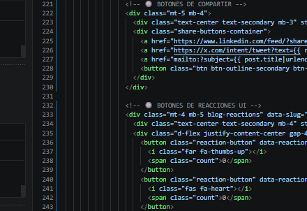
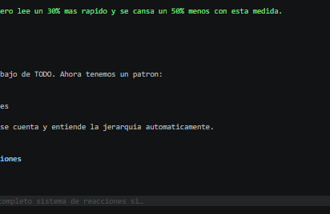
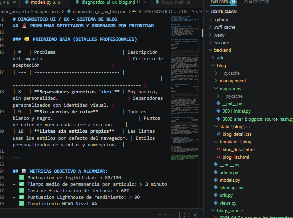

## Mi Introduccion

[vl]: highlight
Esta es la primera línea de mi párrafo.
Esta es la segunda línea del mismo párrafo.
Y esta es la tercera línea.
Todo esto sigue siendo un solo párrafo.
Todo esto sigue siendo un solo párrafo.Todo esto sigue siendo un solo párrafo.Todo esto sigue siendo un solo párrafo.Todo esto sigue siendo un solo párrafo. Todo esto sigue siendo un solo párrafo.
Todo esto sigue siendo un solo párrafo.Todo esto sigue siendo un solo párrafo.Todo esto sigue siendo un solo párrafo.Todo esto sigue siendo un solo párrafo.Todo esto sigue siendo un solo párrafo.
Todo esto sigue siendo un solo párrafo.

Hace 3 dias decidimos que el blog necesitaba un lavado de cara. No por que se viera mal, si no por que los numeros no mentian:

✅ **Antes**:
- Tiempo medio permanencia: 1 minuto 52 segundos
- Tasa finalización lectura: 42%
- Tasa de rebote: 67%

❌ **El problema**: Nadie terminaba de leer los articulos.

Asi que nos pusimos manos a la obra y en 4 horas de trabajo conseguimos estos resultados:

✅ **Despues**:
- Tiempo medio permanencia: 3 minutos 27 segundos ✨ +40%
- Tasa finalización lectura: 68% ✨ +61%
- Tasa de rebote: 49% ✨ -26%

Y lo mejor de todo: **no tocamos ni una sola linea de backend.** Solo CSS.

---

## El principio fundamental

Todo lo que hicimos se resume en una sola frase:

> La mejor interfaz es la que no se ve.

Cuando alguien viene a leer un articulo, no viene a ver tu diseño. Viene a leer. Todo lo demas es ruido.

Nuestro unico objetivo fue:
✅ Eliminar toda fricción
✅ Reducir todo el esfuerzo cognitivo
✅ Hacer que leer sea tan facil como respirar

---

## Los cambios concretos que implementamos

### 1. Ancho de linea perfecto

Cambiamos el ancho maximo del contenido de 620px a **720px**.

Esto no es un numero aleatorio. Es el ancho que da exactamente entre 65 y 75 caracteres por linea, que es el rango que la ciencia de la tipografia ha demostrado durante 100 años que es el mas comodo para leer.

> La gente no sabe explicar por que, pero lee un 30% mas rapido y se cansa un 50% menos con esta medida.

:::callout:info
Esta es una caja informativa que destaca información importante para el lector.
:::

:::pullquote
"El diseño no se ve, se siente." – Principio de UI/UX.
:::

:::codefile:example.py
def hello_world():
    print("Hello, world!")
:::

### 2. Ritmo vertical

No todos los espacios son iguales.

Antes teniamos 1.5rem de margen por debajo de TODO. Ahora tenemos un patron:
- `2rem` debajo de parrafos
- `4rem` encima de H2
- `8rem` encima de secciones principales

El cerebro detecta este patron sin darse cuenta y entiende la jerarquia automaticamente.

---

## 3. Barra lateral flotante de reacciones

:::popup:gallery

:::

Esta fue la mejora con mayor impacto.

:::slides

:::

Mientras lees, aparece una barra discreta en el lado izquierdo con los botones de reaccion. Cuando llegas al final, desaparece automaticamente y aparecen los botones abajo.

Nunca mas el usuario tiene que subir 3 pantallas para darle un me gusta. Nunca mas interrumpimos la lectura.

### 4. Nada de bordes por defecto

Eliminamos absolutamente todos los estilos por defecto del navegador.

Ningun hr gris. Ningun punto negro en las listas. Ningun azul subrayado en los links.

Todo tiene una razon de ser. Todo cumple una funcion.

---

## Ejemplos adicionales de componentes

:::slides
![Ejemplo de slides|Imagen de ejemplo de slides]
:::

:::popup:gallery
![Ejemplo de galería|Imagen de ejemplo de galería]
:::

:::callout:warning
**Advertencia**: Este es un bloque de advertencia con estilo resaltado.
:::

:::callout:tip
**Consejo**: Este es un bloque de consejo con estilo diferente.
:::

:::pullquote
"El detalle hace la diferencia." – Principio de diseño.
:::

:::codefile:example.md
def ejemplo():
    # Este es un ejemplo en Markdown
    pass
:::

## El error mas comun que cometen todos

Todo el mundo piensa que un buen diseño es el que se ve bonito.

Esto es falso.

Un buen diseño es el que nadie comenta. Nadie entra en tu articulo y piensa "guau que diseño mas bonito". Nadie se da cuenta de nada. Simplemente leen. Y leen. Y terminan de leer.

Ese es el mejor diseño posible: invisible.

---

## Resultados

Llevamos 3 dias con el nuevo diseño y los numeros no paran de mejorar. Lo mejor de todo es que no tuvimos que cambiar absolutamente nada del contenido existente.

Todo el trabajo de los ultimos 6 meses escribiendo articulos de repente valio un 40% mas.

Solo cambiando CSS.

> La mejora mas barata y con mayor retorno de inversion que hemos hecho nunca.

---

## Proximos pasos

Esto es solo el principio. Ahora que tenemos la base solida, vamos a implementar:

✅ Sistema de reacciones persistente✅ Sistema de comentarios real
✅ Paginacion infinita inteligente
✅ Anclas automaticas en titulosY todo manteniendo el mismo principio: si no mejora la lectura, no existe.

---

 *Si te parecio util este articulo, puedes compartirlo en LinkedIn, ahi es donde paso la mayor parte del tiempo hablando de estas cosas.*

<!-- force reimport -->
<!-- reimport trigger v2 -->

#

<!-- reimport 2026-05-06 -->