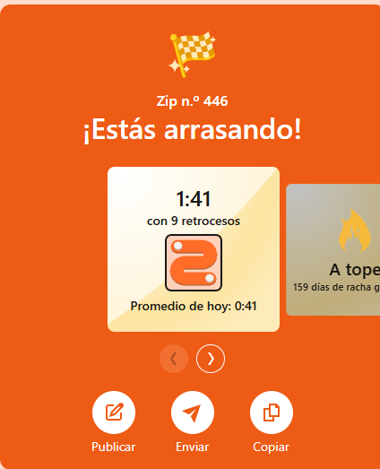
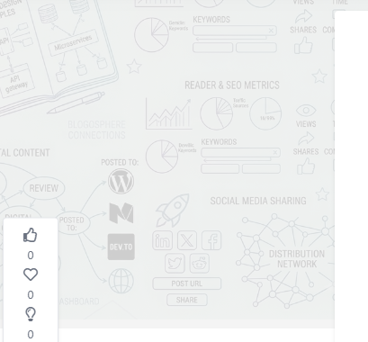

# Introduccion de tu articulo

Aqui va todo el contenido markdown de tu articulo.
Puedes usar listas, imagenes, codigo, etc.

## Seccion 1

Contenido...

## Seccion 2

Mas contenido...

:::slides

:::