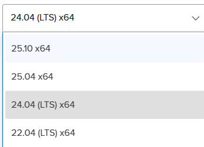

viedo test:
otro video test:

imagen:
dwdwddd
wwwwwwwwwwwwwwwwwwwwwwwwwwww
imagen:
_20aaf632.png)

_20aaf632.png)

_20aaf632.png)

wswwwwwwwww
## Intwsdroduccion1
Este es el primer renglon de mi parrafo.
Este es el segundo rasdasdenglon del mismo parrafo.
Este es el tercer renglon.
Y este es el cuarto renglon.
asdasdasdasd

  
  
<i class="fas fa-play play-icon"></i>

  
Ver video en YouTube

  <button type="button" class="video-widget-menu btn btn-sm" aria-label="Opciones de video" title="Opciones">
    <i class="fas fa-ellipsis-v"></i>
  </button>
  

    <button type="button" class="dropdown-item" data-action="block">Bloquear en artículo</button>
    <button type="button" class="dropdown-item" data-action="delete">Eliminar video</button>
  

un video ahora mismo:

  
  
<i class="fas fa-play play-icon"></i>

  
Ver video en YouTube

Nuevo parrafo aquasdasdi.
asdasdasdasd
asdasdasdasdasd
asdasdasdasdasdasdasdasdas

sdasdasdasd

## Introduccion

Hace 3 dias decidimos que el blog necesitaba un lavado de cara. No por que se viera mal, si no por que los numeros no mentian:

**✅ Antes:**

- Tiempo medio permanencia: 1 miSDnuto 52 segundos
- Tasa finalización lectura: 42%
- Tasa de rebote: 67%

**❌ El problema:** Nadie terminaba de leer los articulos.

Asi que nos pusimos manos a la obra y en 4 horas de trabajo conseguimos estos resultados:

**✅ Despues:**

- Tiempo medio permanencia: 3 minutos 27 segundos ✨ +40%
- Tasa finalización lectura: 68% ✨ +61%
- Tasa de rebote: 49% ✨ -26%

Y lo mejor de todo: **no tocamos ni una sola linea de backend.** Solo CSS.

---
sdasd
## El principio fundamental

Todo lo que hicimos se resume en una sola frase:

:::pullquote
La mejor interfaz es la que no se ve.
:::

Cuando alguien viene a leer un articulo, no viene a ver tu diseño. Viene a leer. Todo lo demas es ruido.

Nuestro unico objetivo fue:

- ✅ Eliminar toda fricción
- ✅ Reducir todo el esfuerzo cognitivo
- ✅ Hacer que leer sea tan facil como respirar

---

## Los cambios concretos que implementamos

### 1. Ancho de linea perfecto

Cambiamos el ancho maximo del contenido de 620px a **720px**.

Esto no es un numero aleatorio. Es el ancho que da exactamente entre 65 y 75 caracteres por linea, que es el rango que la ciencia de la tipografia ha demostrado durante 100 años que es el mas comodo para leer.

:::callout:tip
La gente no sabe explicar por que, pero lee un 30% mas rapido y se cansa un 50% menos con esta medida.
:::

### 2. Ritmo vertical

No todos los espacios son iguales.

Antes teniamos 1.5rem de margen por debajo de TODO. Ahora tenemos un patron:

- `2rem` debajo de parrafos
- `4rem` encima de H2
- `8rem` encima de secciones principales

El cerebro detecta este patron sin darse cuenta y entiende la jerarquia automaticamente.

### 3. Barra lateral flotante de reacciones
asdas
:::slides
:::

Esta fue la mejora con mayor impacto.

Mientras lees, aparece una barra discreta en el lado izquierdo con los botones de reaccion. Cuando llegas al final, desaparece automaticamente y aparecen los botones abajo.

Nunca mas el usuario tiene que subir 3 pantallas para darle un me gusta. Nunca mas interrumpimos la lectura.

### 4. Nada de bordes por defecto

Eliminamos absolutamente todos los estilos por defecto del navegador.

Ningun hr gris. Ningun punto negro en las listas. Ningun azul subrayado en los links.

Todo tiene una razon de ser. Todo cumple una funcion.

---

## El error mas comun que cometen todos

Todo el mundo piensa que un buen diseño es el que no se ve bonito.
asdasd
Esto es falso.
:::callout:warning
Un buen diseño es el que nadie comenta. Nadie entra en tu articulo y piensa "guau que diseño mas bonito". Nadie se da cuenta de nada. Simplemente leen. Y leen. Y terminan de leer.
:::

Ese es el mejor diseño posible: invisible.

---
<!-- reimport 2026-05-06 -->